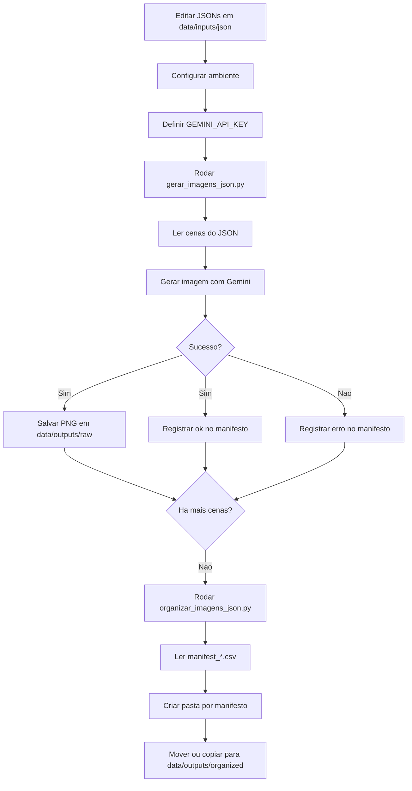

# Gerador de Imagens por JSON

Projeto open source para gerar imagens em lote a partir de arquivos JSON, com organizacao automatica por manifesto.

Este repositorio foi estruturado para ser simples de usar no dia a dia e claro de manter no longo prazo. A ideia e manter uma base que um junior consiga rodar e entender, mas com organizacao suficiente para crescer sem virar bagunca.

## Open Source

Este e um projeto open source.

Se voce quiser contribuir com melhorias, correcoes, documentacao, exemplos de JSON, organizacao de codigo ou novas ideias de fluxo, sua contribuicao e bem-vinda.

Voce pode contribuir com:

- correcao de bugs
- melhoria de prompts e exemplos
- melhoria na documentacao
- refatoracoes pequenas e objetivas
- novas opcoes de CLI
- validacoes extras para os JSONs

## Objetivo do projeto

O projeto resolve duas etapas principais:

1. Gerar imagens a partir de cenas descritas em JSON.
2. Organizar as imagens geradas com base no manifesto CSV produzido no processo.

Os dois scripts principais sao:

- `gerar_imagens_json.py`: le JSONs de entrada, chama a Gemini API e salva imagens + manifesto.
- `organizar_imagens_json.py`: le os `manifest_*.csv` e move ou copia os arquivos para pastas separadas.

## Como pensar no fluxo

Se voce for junior, pense assim:

1. Voce escreve ou edita um JSON com cenas.
2. O script de geracao percorre esse JSON e tenta gerar uma imagem por cena.
3. Cada tentativa fica registrada em um CSV chamado manifesto.
4. Depois, o script de organizacao usa esse manifesto para separar os arquivos gerados.

Se voce for mais experiente, a leitura correta e:

- `data/inputs/` guarda o que entra no pipeline
- `data/outputs/raw/` guarda os artefatos brutos do pipeline
- `data/outputs/organized/` guarda os artefatos reagrupados para uso posterior
- `src/` concentra a logica versionada do projeto

## Estrutura do repositorio

```text
.
|-- .github/
|   `-- workflows/
|       `-- python-check.yml
|-- data/
|   |-- inputs/
|   |   `-- json/
|   `-- outputs/
|       |-- organized/
|       `-- raw/
|-- src/
|   `-- gerador_ia/
|       |-- __init__.py
|       |-- gerar_imagens_json.py
|       |-- organizar_imagens_json.py
|       `-- paths.py
|-- .editorconfig
|-- .env.example
|-- .gitignore
|-- CONTRIBUTING.md
|-- gerar_imagens_json.py
|-- LICENSE
|-- organizar_imagens_json.py
|-- README.md
`-- requirements.txt
```

## Por que essa estrutura foi escolhida

- `src/`: separa codigo-fonte do resto do projeto.
- `data/inputs/json/`: centraliza JSONs de entrada versionados.
- `data/outputs/raw/`: guarda imagens e manifests gerados.
- `data/outputs/organized/`: guarda arquivos ja separados por grupo.
- wrappers na raiz: permitem continuar rodando `python gerar_imagens_json.py` sem precisar decorar caminhos internos.
- `.github/workflows/`: cria uma validacao basica para push e pull request.

Essa separacao evita um problema comum: misturar codigo, arquivos gerados e dados de entrada no mesmo nivel da raiz.

## Requisitos

Para usar o projeto voce precisa de:

- Python 3.10 ou superior
- acesso a internet
- dependencia `google-genai`
- uma chave Gemini API em `GEMINI_API_KEY`

## Instalacao

No PowerShell:

```powershell
python -m venv .venv
.venv\Scripts\Activate.ps1
pip install -r requirements.txt
```

## Configuracao da chave da API

Defina a variavel de ambiente na sessao atual:

```powershell
$env:GEMINI_API_KEY="SUA_CHAVE_AQUI"
```

Se preferir, use o arquivo [.env.example](c:/Users/Giovane ines/Documents/gerador de iamgens ia/.env.example) como referencia para sua configuracao local.

## Uso rapido

Gerar imagens:

```powershell
python gerar_imagens_json.py --input "data\inputs\json\imagens_hino.json"
```

Organizar imagens:

```powershell
python organizar_imagens_json.py
```

## Uso detalhado do gerador

### O que ele faz

Quando voce roda `gerar_imagens_json.py`, o fluxo e este:

1. O script le um JSON unico ou uma pasta com JSONs.
2. Extrai as cenas.
3. Resolve o prompt de cada cena.
4. Gera uma imagem por cena usando Gemini.
5. Salva a imagem em `data/outputs/raw/`.
6. Registra o resultado no manifesto CSV.

### Comando base

```powershell
python gerar_imagens_json.py --input "data\inputs\json\imagens_hino.json"
```

### Parametros principais

- `--input`: arquivo JSON unico ou pasta com varios JSONs.
- `--output`: pasta de saida. Padrao: `data/outputs/raw`.
- `--delay`: pausa entre requisicoes. Padrao: `1.5`.
- `--aspect-ratio`: proporcao da imagem. Ex.: `16:9`, `9:16`, `1:1`.
- `--image-size`: tamanho da imagem. Padrao: `1K`.
- `--max-retries`: numero maximo de tentativas para erros temporarios.
- `--start-index`: comeca da cena N.
- `--limit`: processa apenas N cenas a partir do inicio informado.
- `--manifest-mode`: `append` ou `write`.

### Exemplos praticos

Gerar a partir de um arquivo:

```powershell
python gerar_imagens_json.py --input "data\inputs\json\imagens_narracao.json"
```

Gerar apenas parte do lote:

```powershell
python gerar_imagens_json.py --input "data\inputs\json\imagens_hino.json" --start-index 10 --limit 5
```

Recriar o manifesto do zero:

```powershell
python gerar_imagens_json.py --input "data\inputs\json\imagens_hino.json" --manifest-mode write
```

Trocar proporcao e delay:

```powershell
python gerar_imagens_json.py --input "data\inputs\json\imagens_narracao.json" --aspect-ratio "9:16" --delay 2
```

### Comportamento importante

Se voce passar uma pasta em `--input`, o script ignora automaticamente arquivos `videos_*.json` naquele nivel para evitar erro por falta de `prompt_imagem`.

Isso foi feito para proteger o fluxo real do projeto, onde JSONs de imagem e JSONs de video podem coexistir.

## Uso detalhado do organizador

### O que ele faz

O `organizar_imagens_json.py`:

1. procura `manifest_*.csv` em `data/outputs/raw`
2. cria uma subpasta por manifesto
3. le a coluna `arquivo`
4. move ou copia os arquivos para `data/outputs/organized`

### Comando base

```powershell
python organizar_imagens_json.py
```

### Parametros principais

- `--source`: pasta onde estao manifests e imagens. Padrao: `data/outputs/raw`.
- `--dest`: pasta de destino. Padrao: `data/outputs/organized`.
- `--mode`: `move` ou `copy`. Padrao: `move`.
- `--manifest-glob`: padrao de busca dos manifests.

### Exemplos praticos

Copiar sem remover da origem:

```powershell
python organizar_imagens_json.py --mode copy
```

Definir origem e destino explicitamente:

```powershell
python organizar_imagens_json.py --source "data\outputs\raw" --dest "data\outputs\organized" --mode copy
```

### Resultado por arquivo

- `MOVED`: arquivo movido
- `COPIED`: arquivo copiado
- `SKIP`: arquivo ja existia e era igual
- `REMOVED_DUPLICATE`: duplicado removido da origem no modo `move`
- `MISSING`: manifesto cita um arquivo que nao existe
- `CONFLICT`: arquivo com mesmo nome ja existe no destino, mas com conteudo diferente

## Formato esperado do JSON

### Formato simples

```json
{
  "tipo": "imagens_hino",
  "cenas": [
    {
      "scene_id": "H01",
      "ordem": 1,
      "nome": "cura_do_cego",
      "prompt_imagem": "close-up of a healing scene..."
    }
  ]
}
```

### Formato agrupado

```json
{
  "clipe": "Clipe 1",
  "jsons": [
    {
      "tipo": "imagens_narracao",
      "cenas": [
        {
          "scene_id": "N01",
          "ordem": 1,
          "nome": "abertura",
          "prompt_imagem": "sacred cinematic opening..."
        }
      ]
    }
  ]
}
```

### Campos mais importantes

- `prompt_imagem` ou `prompt`: obrigatorio
- `scene_id`: recomendado
- `ordem`: recomendado
- `nome`: recomendado

## Manifesto CSV

O manifesto e a ponte entre geracao e organizacao.

Cada linha registra uma cena processada com colunas como:

- `source_file`
- `source_tipo`
- `ordem`
- `scene_id`
- `nome`
- `arquivo`
- `status`
- `erro`
- `prompt`

Valores comuns para `status`:

- `ok`
- `skip`
- `erro`

## Erros comuns

`GEMINI_API_KEY nao encontrado`

- a variavel de ambiente nao foi definida antes da execucao

`429 RESOURCE_EXHAUSTED`

- quota, billing ou limite temporario da API
- a resposta pratica normalmente e rodar em lotes menores com `--start-index` e `--limit`

`Cena sem prompt_imagem/prompt`

- o JSON nao tem prompt de imagem
- ou voce esta tentando processar um JSON que nao pertence ao fluxo de imagem

## Fluxo recomendado

1. Edite ou adicione JSONs em `data/inputs/json/`.
2. Configure `GEMINI_API_KEY`.
3. Rode o gerador.
4. Confira as imagens e o manifesto em `data/outputs/raw/`.
5. Rode o organizador.
6. Revise a saida final em `data/outputs/organized/`.

## Fluxograma



## Qualidade e manutencao

O projeto ja inclui uma base minima para manutencao responsavel:

- `.gitignore` para nao versionar artefatos gerados
- `.editorconfig` para padronizar formatacao
- `requirements.txt` para dependencias
- workflow do GitHub para checagem de sintaxe Python

## Como contribuir

Contribuicoes sao bem-vindas.

Fluxo recomendado:

1. faca um fork do projeto
2. crie uma branch para sua alteracao
3. mantenha a mudanca pequena, objetiva e com contexto claro
4. se alterar comportamento, atualize a documentacao
5. abra um Pull Request com descricao direta do problema e da solucao

Antes de abrir PR, o minimo recomendado e:

```powershell
python -m compileall src gerar_imagens_json.py organizar_imagens_json.py
python gerar_imagens_json.py --help
python organizar_imagens_json.py --help
```

Tambem vale abrir issue para:

- bugs
- sugestoes de melhoria
- duvidas sobre estrutura
- ideias de novos fluxos

Para mais detalhes, veja [CONTRIBUTING.md](c:/Users/Giovane ines/Documents/gerador de iamgens ia/CONTRIBUTING.md).

## Autor e contato

Projeto mantido por **Giovane Ines**.

- GitHub: https://github.com/Contagiovaneines
- LinkedIn: https://www.linkedin.com/in/giovaneines/
- Portfolio: https://giovane-portfolio.vercel.app/

## Licenca

Este projeto esta licenciado sob a licenca MIT.

Consulte o arquivo [LICENSE](c:/Users/Giovane ines/Documents/gerador de iamgens ia/LICENSE).
